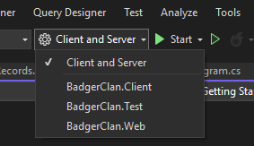
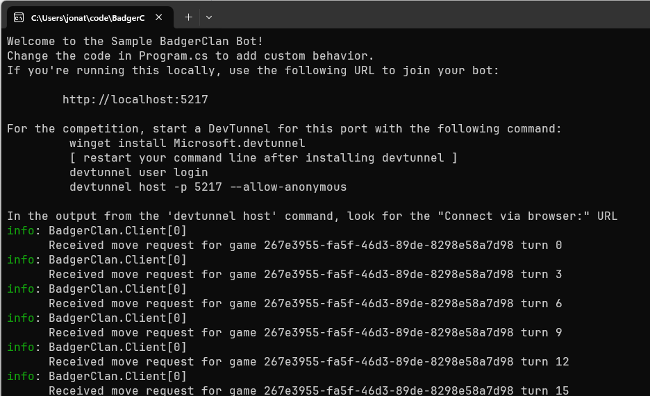

# BadgerClan
A simple game of hexagonal tiles.

> Note: This requires that you have the [.NET 9 SDK](https://dotnet.microsoft.com/en-us/download/dotnet/9.0) installed on your machine.

## Getting Started (using Visual Studio)
1. Clone the repository.
1. Open the BadgerClan.sln file to load the solution.
1. Select the "Client and Server" startup project  
    
1. Press F5 to run the game (or click the solid green "Start" button).
1. A web browser will open to the BadgerClan lobby.  Type in a name for your game and click the "Create New Game" button.
1. You will also see a new terminal open (it may be minimized, check your taskbar). It should say something like "Welcome to the Sample BadgerClan Bot!"
1. Go to "Running the game" below.

## Getting Started (using Visual Studio Code)
1. Clone the repository
1. Open the directory in VS Code
1. In one terminal window, cd into the BadgerClan.Web directory (`cd BadgerClan.Web`) and then run `dotnet run`
1. Open a browser to http://localhost:5172 Type in a name for your game and click the "Create New Game" button.
1. In another terminal window, cd into the BadgerClan.Client directory (`cd BadgerClan.Client`) and run `dotnet run`
1. Go to "Running the game" below.

## Running the game
1. Copy the http://localhost address from the Client terminal window, and paste it into the "Custom" box back in the browser.  Click the "Join Game" button.
1. Now add a few of the other types of bots by selecting the bot type (e.g. Run & Gun) and clicking "Join Game"
1. Once you have at least two bots joined in the game you can click the "Start Game" button.
1. Notice that the terminal window with your Sample BadgerClan Bot is starting to spit out logs. That shows the server is talking to the client.  
    

## Customizing your bot
1. Navigate to BadgerClan.Client and open its Program.cs file
1. Look for the comment that says "Your code goes right here".
1. The `request` object gives you a list of Units with their locations.  Your units are the ones whose `Team` matches `request.YourTeamId`  
    ```csharp
    var myUnits = new List<Unit>();
    foreach(var unit in request.Units)
    {
        if(unit.Team == request.YourTeamId)
        {
            myUnits.Add(unit);
        }
    }
    ```


## Further Information
Coordinate System: https://www.redblobgames.com/grids/hexagons/
